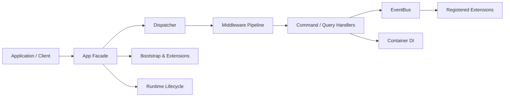
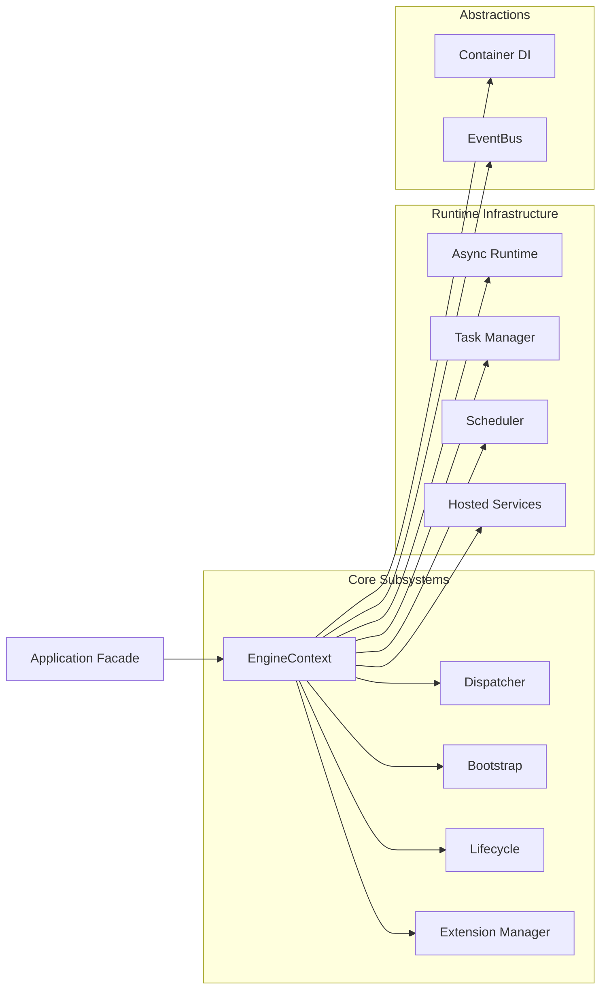
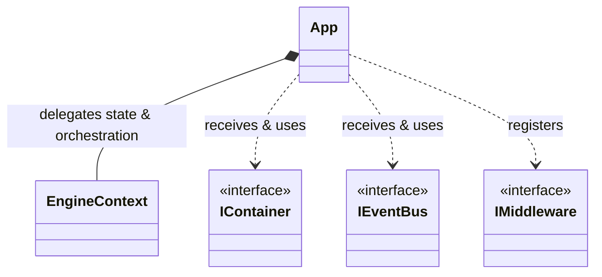
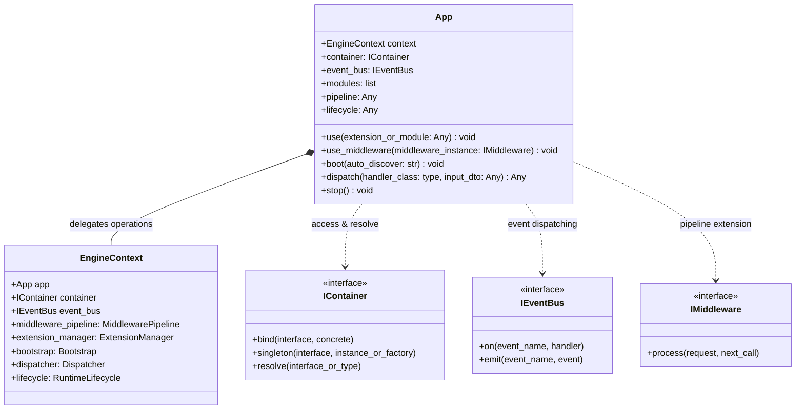

# Architecture Design

AI cần hiểu project trước khi code.

## Architecture Overview Diagram

## Extension Model

Extensions implement `IExtension` and act as plugins that hook into the Engine's lifecycle.
**Two layers, corrected 2026-08-23** (see `../modules.md` for the full account): you implement
`register`/`boot`/`shutdown`; `ExtensionManager` actually calls `initialize`/`start`/`stop`/
`dispose`, which delegate to your methods by default. Overriding the orchestrator layer
without calling `super()` silently skips your own lifecycle code.
They can register background daemon threads (e.g. `TraceServer`, the live trace transport in
`sagittarius_engine/extensions/audit/infra/trace_server.py`) and listen to the `EventBus` to
stream telemetry or intercept commands asynchronously without blocking the main engine thread.

## Application Architecture (Clean Architecture on the engine)

The reference is `examples/student_management` — a real, running, tested app, which is why it
replaced the previous example here. Each layer below names something you can open:

- **Domain**: entities and value objects with no engine imports at all —
  `examples/student_management/domain/student.py` (`Student`, `StudentId`, `Email`).
- **Application**: one directory per use case, each a command/handler pair —
  `examples/student_management/application/use_cases/enroll_student/` (`EnrollStudentCommand`,
  `EnrollStudentHandler`). Ports live beside them:
  `examples/student_management/application/ports/student_repository.py` (`IStudentRepository`).
- **Infrastructure**: the adapters that satisfy those ports —
  `examples/student_management/infrastructure/persistence/sqlalchemy_student_repository.py`
  (`SqlAlchemyStudentRepository`).
- **Presentation**: presenters over views, never widgets calling use cases directly —
  `examples/student_management/presentation/roster/roster_presenter.py` (`RosterPresenter`).

**Changed 2026-08-26 (`EPIC-005A`).** This section documented tools/audit_dashboard/, which
has been deleted: all three of its inner layers were scaffolding wired to nothing — the Domain
entities were constructed nowhere, the use case and event layers were no-op stubs behind
`try/except ImportError`, and the one line that mattered `str()`-dumped a dict into a text box
(`EPIC-005` §2, `D2`–`D5`). It was the worst possible worked example: correct-looking folders
demonstrating a structure that no code actually used. Recoverable from the
`archive/pre-epic-005-audit` branch.

## EngineContext Subsystem Composition

## Class Diagrams (`App` Facade)

### High-Level Class Dependency Diagram

### Detailed Class Diagram

