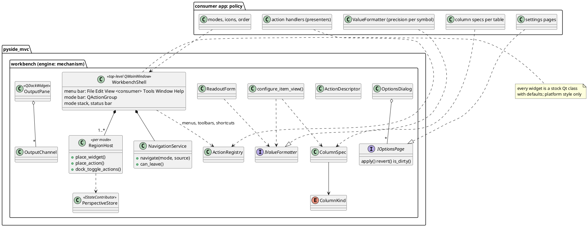

# EPIC-008: QtWidgets Workbench

- **Status**: ✅ Completed (6/6)
- **Created**: 2026-10-04
- **Priority**: P1 — the only consumer's UI rebuild (Elite EPIC-033) waits on it
- **Category**: UI Engine / Workbench (`pyside_mvc`)
- **Decided by**: [`ADR-003`](../../decisions/ADR-003_qtwidgets_workbench.md)
- **Builds on**: `TASK-043` E1-E2 (contribution registry, `RegionHost`); `extensions/ui_state` (persistence)

> ### Naming collision — read before citing
> `Sagittarius_Elite_Warrior` also has an `EPIC-008`. Inside this repository `EPIC-008x` means this epic; the other is **Elite EPIC-008**. The consumer cites this one as **Engine EPIC-008** (the convention `REF-003` asks for).

---

## 1. What this builds
The mechanism a desktop application needs to be a standard Windows-style workbench made of stock Qt controls: a top-level shell with the standard menu bar and a mode bar, mode hosts whose toolbars carry actions and whose docks the View menu can show and hide, named perspectives, commands as `QAction`s with shortcuts and confirmation, one Options dialog, one Output dock, and display conventions that make every table, list and read-out of a kind look and behave the same. The engine owns the mechanism; the consumer owns the policy (which modes, which commands, which columns, which precision).

Consumer evidence: Elite EPIC-033 and its [UI review](https://claude.ai/artifact/Np92LCSrk2t2e8NQxLEkaE) — no menu bar, 1 of 8 modes a workbench, 13 button styles, 12 hand-configured tables.

## 2. Decisions (ADR-003)
1. The user, 2026-10-04: "cái nào cần sửa bên engine thì sửa bên engine" (what needs changing in the engine is changed in the engine); "làm trực tiếp bên engine luôn, ko cần phải dựng ở app trước" (do it directly in the engine, no need to build it in the app first). The workbench mechanism is built here now; `TASK-043`'s harvest-first rule is superseded for it.
2. The user: "các UI thì phải đồng nhất … 1 kiểu thui … làm 1 UI sơ đẳng, nhưng đúng triết lý Window app trước, chưa cần tính đến design" (the UI must be uniform, one kind only; a plain UI true to the Windows-app philosophy first, design later). The engine's QtWidgets contract is stock controls in the platform style; tokens and the QML kit bind QML consumers only.
3. The user: "các widget hiện thị cũng phải thống nhất, ví dụ mấy cái mảng thì phải thông nhất các properti" (display widgets must be uniform too, e.g. tables share the same properties). Display conventions (`ColumnKind`, `IValueFormatter`, `ReadoutForm`) are engine mechanism.
4. The user: "tốt nhất là nên tham khảo triết lý UI WINDOW của các tổ chức lớn" (best to draw on the Windows UI philosophy of the major organisations). The rule and every subtask's acceptance criteria cite Microsoft Windows User Experience Interaction Guidelines (`learn.microsoft.com/en-us/windows/win32/uxguide`), Microsoft Fluent / Windows app design, KDE HIG (`develop.kde.org/hig`), Apple HIG, GNOME HIG and Qt's styling guidance (`doc.qt.io/qt-6/qtwidgets-styling-approaches.html`); where they disagree the Windows desktop choice wins (Options, platform button order, Apply semantics).
5. Agent, `.agents/ONBOARDING.md` §10.5: one abstraction per file; a new `pyside_mvc/workbench/` package; every new public symbol in `pyside_mvc.__all__`; a `b` version bump when released.

## 3. Design — as-is and to-be (ONBOARDING §10.5 item 3)

### As-is
```plantuml
@startuml as_is
package "pyside_mvc (engine)" {
  class PresenterManager <<QStackedWidget router>>
  class RegionHost <<QMainWindow, nested>> {
    +place_widget(place, widget, title)
    +save_perspective() : bytes
    +restore_perspective(bytes)
    -_docks : dict
    -toolbars : addWidget(), not movable
  }
  class ContributionRegistry {
    +contribute(ContributionDescriptor)
    +panels(surface, place)
  }
  package tokens <<QML only>>
  package "QML kit" <<QML only>>
}
package "consumer app" {
  class MainWindow <<QMainWindow, no menu bar>>
  class Sidebar <<custom, styled>>
  class PageShell <<custom page>>
  class "kit (QSS per widget)" as Kit
  MainWindow --> Sidebar
  MainWindow --> PresenterManager
  PageShell ..> Kit
}
RegionHost ..> ContributionRegistry : consumer fills it
note bottom of RegionHost : one mode uses it; no menus, no actions,\nno settings dialog, no output pane,\nno display conventions anywhere
@enduml
```

### To-be


## 4. Subtasks
| ID | Subtask | Status |
| :--- | :--- | :---: |
| [EPIC-008A](completed/EPIC-008A_qtwidgets_rule_rewrite.md) | The UI rule describes a QtWidgets workbench in the platform style | ✅ Completed (2026-10-04) |
| [EPIC-008B](completed/EPIC-008B_region_host_actions_and_perspectives.md) | A mode host takes actions on its toolbars, exposes its docks to a View menu and keeps a named perspective | ✅ Completed (2026-10-04) |
| [EPIC-008C](completed/EPIC-008C_action_contributions.md) | Every command is an ActionDescriptor: one QAction for its menu entry, toolbar button and shortcut | ✅ Completed (2026-10-04) |
| [EPIC-008D](completed/EPIC-008D_workbench_shell_and_navigation.md) | WorkbenchShell: the top-level window with the standard menu bar, a mode bar, View built from docks, Reset layout and a status bar | ✅ Completed (2026-10-04) |
| [EPIC-008E](completed/EPIC-008E_options_dialog_and_output_pane.md) | One Options dialog with contributed pages, and one Output dock with contributed channels | ✅ Completed (2026-10-04) |
| [EPIC-008F](completed/EPIC-008F_display_conventions.md) | Tables, lists and read-outs of one kind share their properties: column and value kinds decide them | ✅ Completed (2026-10-04) |

Order: A (rule) → B, C, F (independent) → D (needs B, C) → E (needs D's shell for Ctrl+,).

## 5. Exit criteria
- Every subtask's tests pass under the full gate; each new guard mutation-verified.
- `examples/student_management` runs on `WorkbenchShell` with a mode, a dock, an action with a shortcut, an options page, an output channel and a table built from `ColumnSpec`s.
- A release with a `b` version bump that the consumer pins in its `engine.ref`.

## 6. Out of scope
Visual design and any theme; QML kit retirement (a later engine decision); app-specific chrome such as an environment banner (stays in the consumer, as `region_host.py` already decided).

## Notes
- **2026-10-04** — Planned from the consumer's EPIC-033; the user confirmed engine-first.
