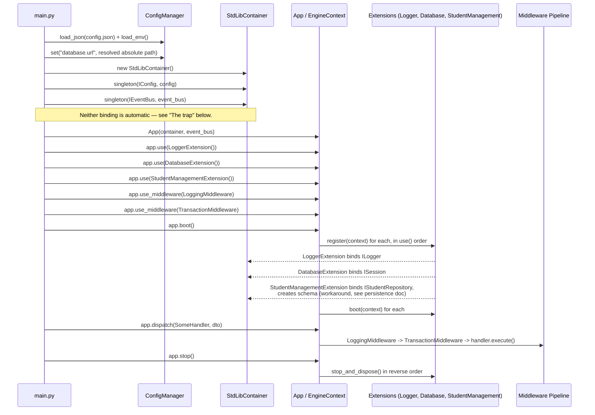

# Bootstrap — how this app comes up and shuts down

Written 2026-08-23 while building `EPIC-002A`, at the point this sequence was actually
verified working end to end (`main.py enroll ...` run for real, not just imagined).

## The sequence

## The trap: `App(container, event_bus)` does not make either resolvable

Expected (reasonable, and wrong): passing `event_bus` into `App`'s constructor means any
extension or handler can later do `container.resolve(IEventBus)` and get it.

Actual, verified by reading `kernel/context.py`: `EngineContext.__init__` only registers
`AsyncRuntime`, `TaskManager`, `Scheduler`, `HostedServiceManager`, and `IDispatcher` into the
container. `IEventBus` and `IConfig` are **not** auto-bound — they're reachable via
`app.event_bus` / `context.event_bus` as plain attributes, but `container.resolve(IEventBus)`
raises `DependencyResolutionError` unless the app's own bootstrap does
`container.singleton(IEventBus, event_bus)` itself. Same for `IConfig`.

**Consequence if missed:** any handler whose constructor asks for `event_bus: IEventBus` (the
natural way to write it, since the container auto-injects constructor params by type) fails to
resolve at dispatch time — not at boot time, so the failure surfaces late, on the first command
that needs it. `main.py`'s `build_app()` binds both explicitly, first thing, before
`app.use(...)` — see the two `container.singleton(...)` lines right after `App(...)` is
constructed.

## Shutdown

`app.stop()` runs extensions' `shutdown()` in reverse registration order (confirmed by reading
`App.stop()` in `kernel/app.py`) — `StudentManagementExtension` before `DatabaseExtension`
before `LoggerExtension`. Nothing in this app currently depends on that order for shutdown
specifically (unlike registration order, which does matter — see `module_registration.md`),
but it's worth knowing it's automatic and reversed, not something each extension has to get
right itself.
