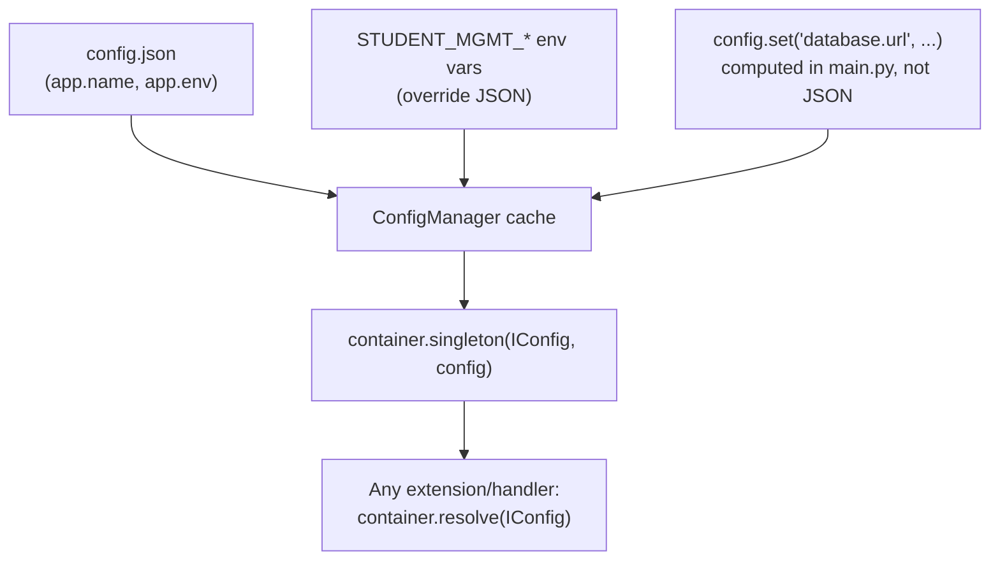

# Config loading — layers, and the one value that can't live in the JSON file

Written 2026-08-23 at the point this app's config strategy was settled.

## Layers

`ConfigManager` merges sources in the order they're added, later overriding earlier
(`infrastructure/config/config_manager.py`'s own docstring states this, verified against
`_load()`'s `self._cache.update(data)` loop). This app adds exactly two declarative sources —
`config.json`, then an env prefix `STUDENT_MGMT_` — plus one value set directly in code.

## Why `database.url` is not in `config.json`

A relative path written into a static JSON file resolves against the process's **current
working directory** at the time `sqlite:///...` gets opened — not against where `config.json`
itself lives. Running `python -m examples.student_management.main` from the repo root versus
from inside `examples/student_management/` would silently point at two different files (or
silently create the database in the wrong place, which is worse than an error).

`main.py`'s `build_app()` instead computes an absolute path —
`Path(__file__).resolve().parent / "data" / "student_management.db"` — anchored on the
package's own location, immune to the caller's working directory. This is `config.set(...)`,
called once, right after the JSON/env sources load and before anything resolves `IConfig`.

## The one thing this doesn't cover: test isolation

Tests can't use the computed default path (parallel test runs would share one file, and a
previous run's leftover data would leak into the next). `build_app()` therefore takes an
optional `db_url` override specifically so
`tests/test_app_integration.py` can pass a fresh `tempfile.TemporaryDirectory()` path per test.
This is the one deliberate escape hatch in an otherwise fixed config-loading path — worth
knowing about before assuming `build_app()` always uses the real database file.
