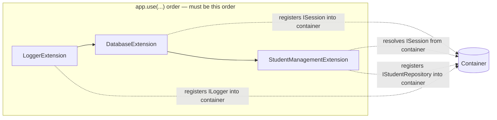

# Module registration — why order isn't declarative, and why it matters here

Written 2026-08-23, at the point registration order was confirmed to actually matter (not
theorized) — removing it from `main.py` and re-running failed exactly as predicted.

## The dependency graph



`StudentManagementExtension.register()` does `context.container.resolve(ISession)` — that
call fails immediately (`DependencyResolutionError`) unless `DatabaseExtension.register()`
already ran and bound `ISession`.

**Correction, 2026-08-23 (found while cross-checking `.agents/context/project.md`'s claim
"dependency order is resolved automatically" against this exact scenario — the claim is true,
this file's first version was incomplete, not the engine):** `ExtensionManager._build_and_sort`
does a real topological sort, keyed on `descriptor.dependencies` — a list of **strings**
matched against another extension's `descriptor.name` (which defaults to the class name).
Verified directly: adding `dependencies = ["DatabaseExtension"]` as a class attribute on
`StudentManagementExtension` makes `app.boot()` succeed even with `app.use()` called in the
*wrong* order — the sort reorders it correctly before any `register()` runs. This app now
declares that dependency (`infrastructure/persistence/extension.py`) instead of relying on
`app.use()` call order alone — the declarative form doesn't depend on every future maintainer
remembering an unenforced ordering rule; `app.use()` order stops mattering the moment you
have more than a trivial straight line. The `app.use()`-order-only path below is kept as a
record of the failure mode this correction avoids, not as the recommended pattern.

## What actually happens if the order is wrong

Verified 2026-08-23 by actually swapping the order (`app.use(StudentManagementExtension())`
before `app.use(DatabaseExtension())`) and running `app.boot()` — not assumed from reading the
code:

```
sagittarius_engine.exceptions.DependencyResolutionError:
Cannot instantiate abstract class <class 'sagittarius_engine.extensions.persistence.i_session.ISession'>
```

Thrown from inside `StudentManagementExtension.register()`, at `app.boot()` time — before any
command is ever dispatched. Worth noting the message names the *abstract* class being
resolved, not "no binding found" — the container's fallback path tries to instantiate
`ISession` itself when nothing bound it, and fails because it's an `ABC`. Still a loud,
immediate failure at boot, not a silent `None` or a late failure on first use — just not
phrased the way a first guess at the message would expect.

## The legacy `IModule` path was rejected for exactly this app

The deleted old sample used `IModule` (`kernel/extension_manager.py:22` calls it "a legacy
`IModule`" in the engine's own code) instead of `IExtension`. `IExtension` is what every other
shipped extension in this engine implements (`LoggerExtension`, `DatabaseExtension`,
`HealthExtension`, `AuditExtension`, `ThreadManagerExtension`) — using anything else here would
have made this app a worse reference, not a different-but-valid one.
