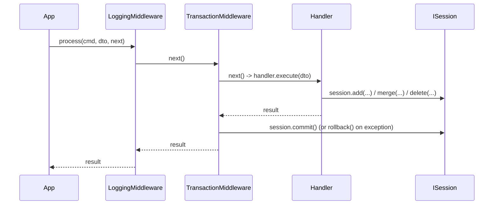

# Persistence & transactions — the schema-creation gap, and the commit boundary

Written 2026-08-23, the point both of these were settled. Not one of the three topics named
up front in `EPIC-002A`'s own task file — added because it turned out to be a real decision,
per that file's own instruction to write up any topic that turns out non-trivial.

## Where transactions actually commit

`SqlAlchemyStudentRepository` deliberately never calls `commit()` itself — only
`add`/`get`/`merge`/`delete` on the session. `TransactionMiddleware`
(`extensions/persistence/transaction_middleware.py`) owns the commit/rollback boundary, once
per dispatched command, wrapping the handler as closely as possible (registered *after*
`LoggingMiddleware` — see `bootstrap.md` for why middleware order is outer-to-inner in
registration order). Verified by `test_full_stack_transaction_commits_on_success`: a student
enrolled in one `app.dispatch()` call is visible to a completely separate `app.dispatch()`
call for the roster report — proof the first dispatch actually persisted, not just staged.

**Consequence for anything calling the repository outside `app.dispatch()`** (a script, a
direct unit test): nothing commits automatically. `tests/infrastructure/test_sqlalchemy_student_repository.py`
calls `repo._session.commit()` explicitly after every mutation for exactly this reason.

## The schema-creation gap — fixed by `EPIC-003B` (was `TASK-019`)

The engine's `DatabaseExtension` used to build a SQLAlchemy `Engine` internally to satisfy
`ISession`, but never expose that `Engine` anywhere a consumer could reach it — not via the
container, not as a property on `ISession`/`SQLAlchemySessionAdapter`. Filed as `TASK-019`
rather than worked around invisibly — see `ONBOARDING.md` §3 point 6 for why a confirmed gap
gets a task immediately, not just a note here.

`TASK-019` was superseded by `Sagittarius_Engine`'s `EPIC-003B`
(`Tasks/epics/EPIC-003_database_extension_multi_db/`), which registers the `Engine`
`DatabaseExtension` itself built as a container singleton (`container.resolve(Engine)`).
`StudentManagementExtension.register()` now resolves that same `Engine` and calls
`Base.metadata.create_all()` directly on it — no second, throwaway `Engine`, and no
`:memory:` special-casing needed: since it's the *same* `Engine` the session uses, there's
only ever one database, file-based or `:memory:` alike.
