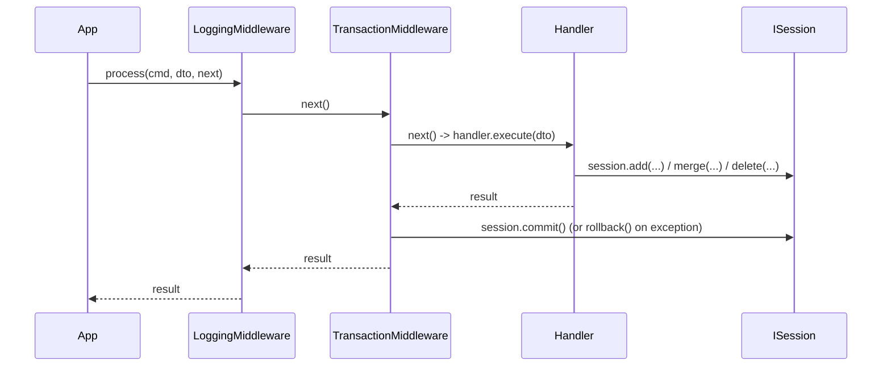

# Persistence & transactions — the schema-creation gap, and the commit boundary

Written 2026-08-23, the point both of these were settled. Not one of the three topics named
up front in `EPIC-002A`'s own task file — added because it turned out to be a real decision,
per that file's own instruction to write up any topic that turns out non-trivial.

## Where transactions actually commit

`SqlAlchemyStudentRepository` deliberately never calls `commit()` itself — only
`add`/`get`/`merge`/`delete` on the session. `TransactionMiddleware`
(`extensions/persistence/transaction_middleware.py`) owns the commit/rollback boundary, once
per dispatched command, wrapping the handler as closely as possible (registered *after*
`LoggingMiddleware` — see `bootstrap.md` for why middleware order is outer-to-inner in
registration order). Verified by `test_full_stack_transaction_commits_on_success`: a student
enrolled in one `app.dispatch()` call is visible to a completely separate `app.dispatch()`
call for the roster report — proof the first dispatch actually persisted, not just staged.

**Consequence for anything calling the repository outside `app.dispatch()`** (a script, a
direct unit test): nothing commits automatically. `tests/infrastructure/test_sqlalchemy_student_repository.py`
calls `repo._session.commit()` explicitly after every mutation for exactly this reason.

## The schema-creation gap (real engine gap, filed as `TASK-019`)

The engine's `DatabaseExtension` builds a SQLAlchemy `Engine` internally to satisfy `ISession`,
but never exposes that `Engine` anywhere a consumer can reach it — not via the container, not
as a property on `ISession`/`SQLAlchemySessionAdapter`. Confirmed by reading both files in
full and grepping for `Engine` registrations in `extensions/persistence/` (zero hits). Filed as
[`TASK-019`](../../../Tasks/backlog/TASK-019_database_extension_expose_engine.md) rather than
worked around invisibly — see `ONBOARDING.md` §3 point 6 for why a confirmed gap gets a task
immediately, not just a note here.

**This app's workaround**, in `StudentManagementExtension.register()`: rebuild a second,
throwaway `Engine` from the same `database.url` config value, call
`Base.metadata.create_all()` on it, then `dispose()` it.

### Why that workaround only works for a file-based URL, not `:memory:`

Two separate `Engine` instances created from `sqlite:///:memory:` are two **separate,
unrelated** in-memory databases — SQLite's `:memory:` special-case means each new connection
gets its own private database, not a shared one keyed by the URL string. Running
`create_all()` on the throwaway engine would create tables nobody else can see; the real
session's database would stay schema-less and fail on first query with a "no such table"
error. `StudentManagementExtension.register()` raises `ValueError` immediately if
`database.url` contains `:memory:`, specifically to fail loud at boot instead of failing
confusingly on the first real query. This is why `main.py` uses a real file
(`data/student_management.db`) and why tests use a `tempfile` path (`config_loading.md`) —
never `:memory:`, anywhere in this app.
