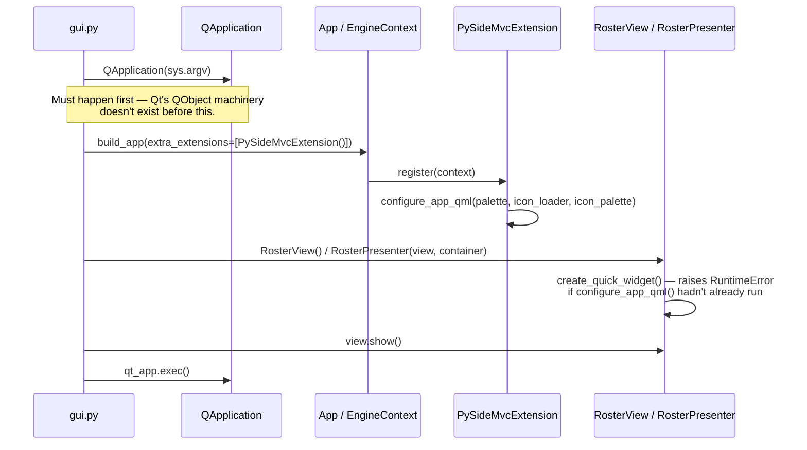

# UI extension lifecycle — booting `pyside_mvc` as a real `IExtension`

Written 2026-08-23, once the ordering was genuinely settled — after a long investigation that
also produced a real methodology correction (see the last section).

## The resolved ordering question

[EPIC-001D](../../../Tasks/epics/EPIC-001_ui_engine_foundation/incomplete/EPIC-001D_runtime_slot_registry.md)
flagged an open question: does `pyside_mvc` becoming a real `IExtension` conflict with the
fact that `configure_app_qml()` needs a `QApplication` to already exist? Verified 2026-08-23:
**it doesn't conflict, as long as the composition root constructs `QApplication` before
calling `App.boot()`** — no engine change needed, no awkward workaround.

`PySideMvcExtension` (`infrastructure/ui/pyside_mvc_extension.py`) is an app-side `IExtension`
wrapper — no such class exists in the engine yet (`grep -rln IExtension
sagittarius_engine/extensions/pyside_mvc/` still returns nothing). This is intentional, not an
oversight: writing it as engine code would mean silently doing a piece of EPIC-001D's own
design work without that epic's own questions (shell, regions, registry) being settled. This
wrapper is a real, running prototype EPIC-001D can read before building the engine-side
version — not a substitute for it.

## `pyside_mvc` used for real, not for coverage

- **Tokens**: `presentation/theme/palette.py` supplies all 10 `REQUIRED_COLOUR_TOKENS`, distinct from
  the reference consumer's own palette (deliberately — this sample is its own thing).
- **Widget kit**: `RosterScreen.qml` composes `AppDataTable` (the roster), `BaseCard` (stats
  summary, with a real `Switch` bound to `viewModel.compactMode` — not just two static
  instances side by side), and `AppModal` (the enroll form) — three real components, not one.
- **MVC scaffolding**: `RosterView(QmlHostView)`, `RosterPresenter(BasePresenter)`,
  `RosterViewModel(BaseQmlViewModel)` — the real base classes, not reimplemented. No FSM
  (`INITIAL_STATE` left `None`) — see `MODULE_COVERAGE.md`'s `fsm` row for why a roster screen
  has no honest use for one.
- **Event bus, for real UI-application coupling**: `RosterPresenter._connect_engine_events()`
  subscribes to `StudentEnrolled`/`StudentUpdated`/`StudentRemoved` and refreshes the whole
  roster in response — the UI never manually refreshes itself after a dispatch; it reacts to
  the same domain event the CLI would also see.

## A long investigation, and a real methodology correction

While verifying "zero QML runtime warnings" (mirroring
`test_gallery_emits_no_qml_runtime_warnings`'s own technique), an apparent defect was chased
for a long time — reparenting `QmlHostView`'s `QQuickWidget` before `setSource()`, initially
filed as an engine task. **That filing was retracted after further investigation.** The real
story, in order:

1. Piping test output through `tail -N` repeatedly cut off pytest's own `N passed` summary
   line, buried under a flood of raw stderr — every "failure" investigated was, in fact, a
   passing test the whole time. Confirmed by re-running with a clean, untruncated exit code
   check: `1 passed`, `exit 0`, every time.
2. The real source of the stderr flood: `AppDataTable`'s internal `ListView` re-evaluates its
   `Theme.*` and `viewModel.*` bindings the moment `RosterPresenter.refresh()` emits
   `studentsChanged`/`statsChanged` — which happens synchronously in `__init__`, very early in
   the widget's life. The resulting `TypeError: Cannot read property '<x>' of null` messages
   print **directly to stderr**, bypassing `qInstallMessageHandler` entirely — confirmed by
   installing a handler, observing zero captured messages, and separately confirming (via
   `grep` on raw stderr) that the same 75 lines print regardless of `QmlHostView`'s reparent
   order, the icon loader used, or how long the `refresh()` call is deferred.
3. **This is not a functional defect** — the final Python-side state is always correct
   (`presenter.view_model.students`/`.totalStudents` match the database exactly), and no test
   assertion fails. It is a real, reproducible, purely cosmetic console-noise artifact, bounded
   to the first paint of any `AppDataTable`-containing screen fed by an immediate `Presenter`
   refresh. Named here, not filed as an engine task, because no confirmed root cause or
   actionable fix point was found — chasing it further had already cost far more investigation
   time than the (zero) functional impact justified.
4. **What IS worth carrying forward**: `qInstallMessageHandler` — the technique this
   codebase already trusts to catch "silent" QML runtime failures (per
   `test_gallery_emits_no_qml_runtime_warnings`'s own docstring) — has a real blind spot for
   this specific error class (QML JS engine `TypeError`s printed directly, not routed through
   `qWarning()`). A future "zero warnings" check that matters more than cosmetics should not
   assume `qInstallMessageHandler` catching nothing means nothing happened — check raw
   stderr too, when it counts.
